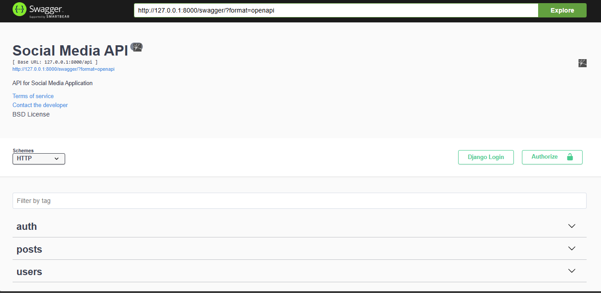
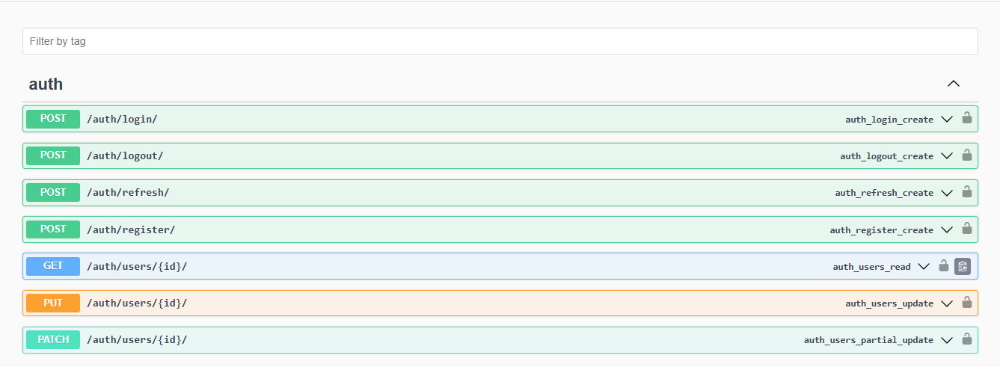
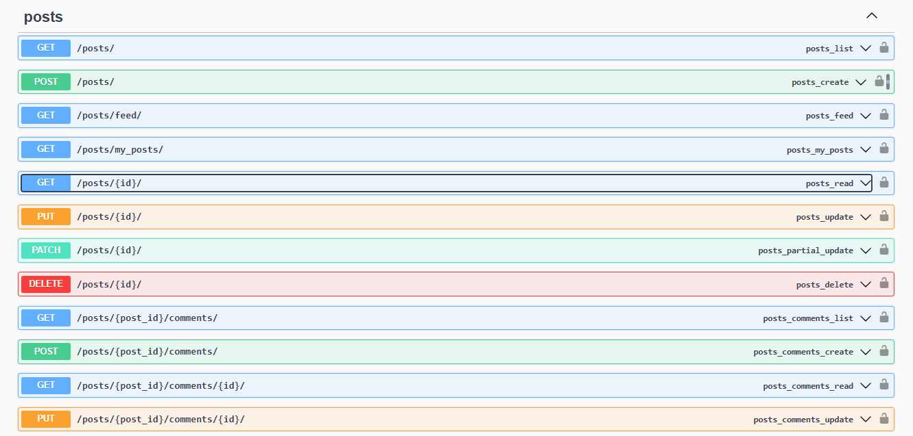
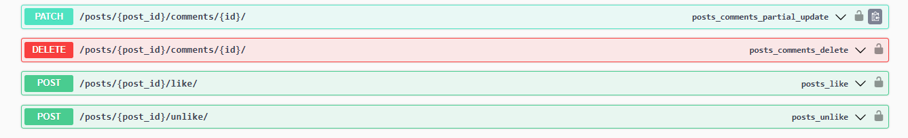
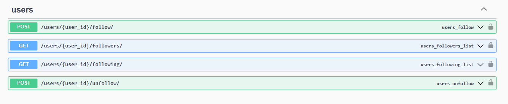
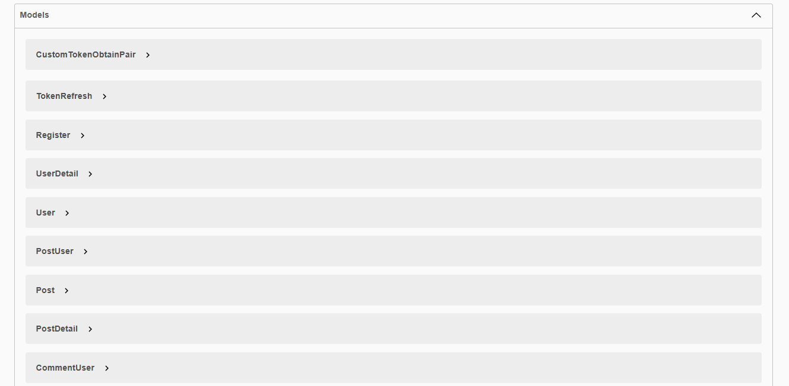
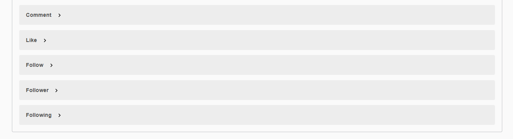

# 🚀 Django Social Media API

A fully functional social media backend built with Django and Django REST Framework (DRF). This project includes user authentication, post creation, interactions (likes & comments), follow system, and profile management.

## 📌 Features

- ✅ User Authentication (JWT-based) 🔐
- ✅ CRUD for Posts 📝
- ✅ Like & Comment System ❤️💬
- ✅ Follow/Unfollow Users 🔄
- ✅ Profile Management 🏆
- ✅ CORS Support 🌍
- ✅ Scalable & Secure Design 🔒

## 📡 API Endpoints (Brief)

### 🔑 Authentication

- **POST** `/api/auth/register/` → User Registration
- **POST** `/api/auth/login/` → User Login (JWT)

### 📝 Posts

- **GET** `/api/posts/` → List all posts
- **POST** `/api/posts/` → Create a post
- **GET** `/api/posts/{id}/` → Retrieve a single post
- **PUT** `/api/posts/{id}/` → Update a post
- **DELETE** `/api/posts/{id}/` → Delete a post

### ❤️ Likes & Comments

- **POST** `/api/posts/{id}/like/` → Like a post
- **POST** `/api/posts/{id}/comment/` → Comment on a post

### 🔄 Follow System

- **POST** `/api/follow/{username}/` → Follow/Unfo llow a user
- **GET** `/api/followers/` → List followers
- **GET** `/api/following/` → List following

### 🏆 Profile

- **GET** `/api/profile/{username}/` → View user profile
- **PUT** `/api/profile/{username}/` → Update user profile

## 📡 API Endpoints Doc **_Swagger_** (Detailed)

For a comprehensive and interactive API documentation, Swagger UI is integrated into the project. You can access it by navigating to:

- **URL**: `http://127.0.0.1:8000/swagger/`

This provides a user-friendly interface to explore and test all available API endpoints.







### 🗂️ Models

In this project, the following models are implemented to support the social media functionality:

- **👤 User**: Represents the users of the platform, including authentication and profile details.
- **📝 Post**: Stores the content of posts created by users.
- **❤️ Like**: Tracks likes on posts by users.
- **💬 Comment**: Manages comments made on posts.
- **🔄 Follow**: Handles the follow/unfollow relationships between users.

Each model is designed with scalability and security in mind to ensure a robust backend structure.




## Project Structure

The Django Social Media App is organized into the following key components:

1. **User Authentication** – Secure user registration, login/logout functionality.
2. **User Profiles** – Users can create, edit, and view profiles.
3. **Posts** – Functionality for creating, editing, and deleting posts.
4. **Likes and Comments** – Users can like/unlike posts and comment on them.
5. **Follow System** – Follow/unfollow users, view followers and following.
6. **API Documentation** – Documentation using Swagger or Postman for API usage.

## How to Contribute

Follow the instructions below to get started contributing to the project:

### 1. **Clone the Repository**

Start by cloning the repository to your local machine. This will create a copy of the project on your local system.

````bash
git clone https://github.com/yourusername/django-social-media-app.git


### 2. **Create a New Branch**
Before starting any work, create a new branch for the task or feature you are working on. This will help keep the main branch (usually main or master) clean and free of incomplete work.

```bash
git checkout -b your-branch-name

### 3. **Make Changes**
Now, start working on your feature or task. Be sure to follow the coding conventions and best practices for Django and DRF. Write clear, concise commit messages that describe the changes you made.

### 4. **Stage Your Changes**
Once you have completed your work, add the changed files to the staging area.

```bash
git add .

### 5. **Commit Your Changes**
Commit your changes with a meaningful message.

```bash
git commit -m "Describe the changes you made"


### 6. **Pull Latest Changes from main (if necessary)**
Before pushing your changes, it's a good idea to pull the latest changes from the main branch to ensure you have the most up-to-date version of the project. This helps avoid conflicts.

```bash
git pull origin main


### 7. **Push Your Changes**
Push your changes to the remote repository on GitHub.

```bash
git push origin your-branch-name


### 8. **Create a Pull Request**
Once your changes are pushed, go to the GitHub repository and create a Pull Request (PR). In the PR description, provide a clear explanation of what your changes do and any specific details the reviewers should know.

### 9. **Review and Merge**
After your pull request is reviewed and approved, it will be merged into the main branch. Be sure to delete your branch after the merge to keep the repository clean.


If you want to contribute to this project, follow the steps above for cloning, creating branches, pushing, and submitting pull requests. Be sure to follow the coding conventions and test your changes before submitting them.
````
